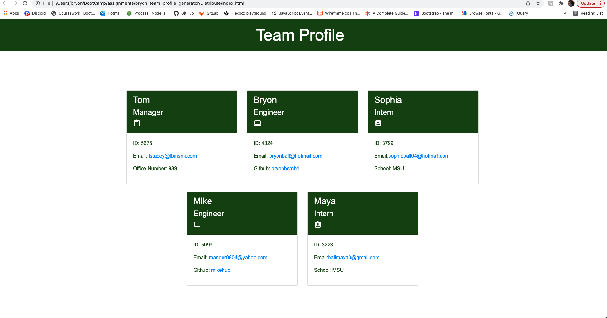

# bryon_team_profile_generator

Built out a Node.js command-line application that takes in information about employees on a software engineering team, then generates an HTML webpage that displays summaries for each person. 

# HTML and Video generated from the App

Here is the link to my video demo of the App [Video](https://youtu.be/NX76Bdfg-7Y)

